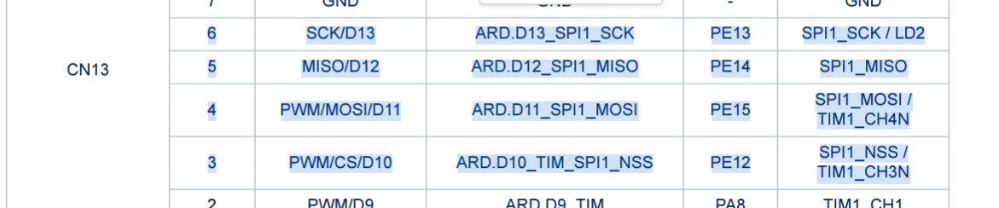
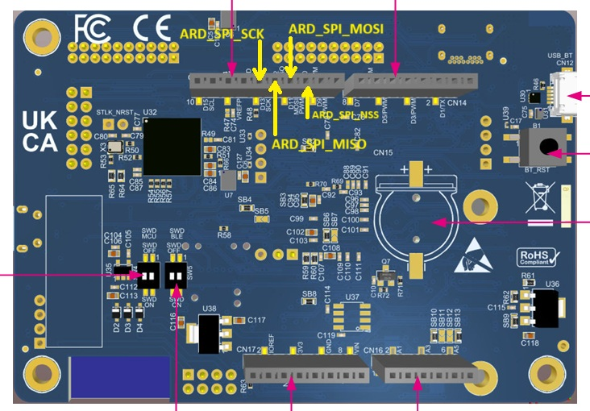
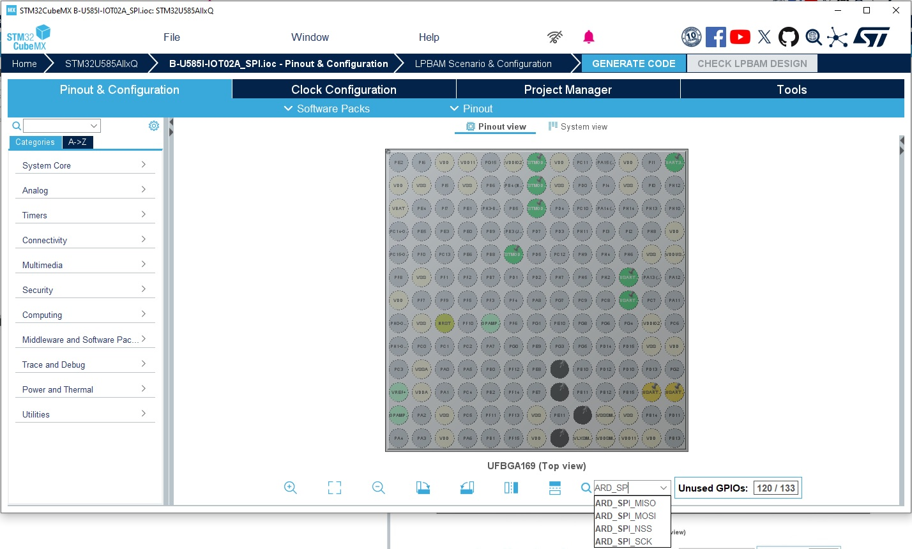
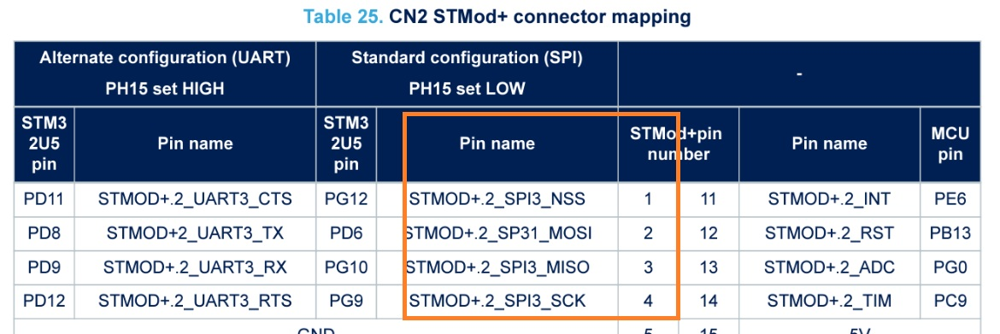
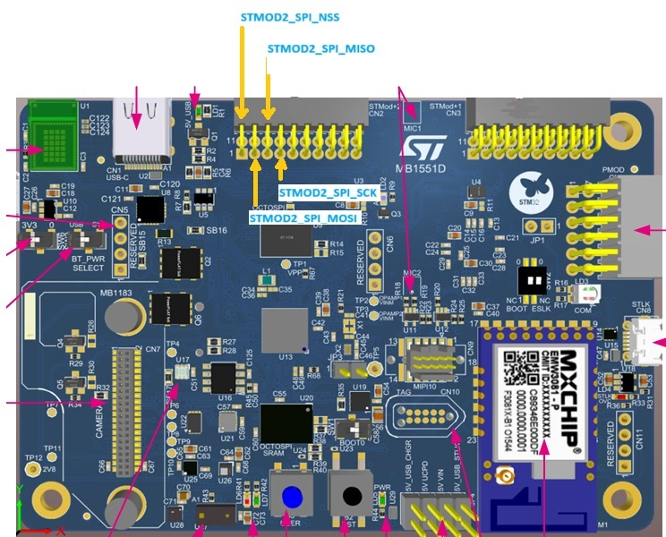
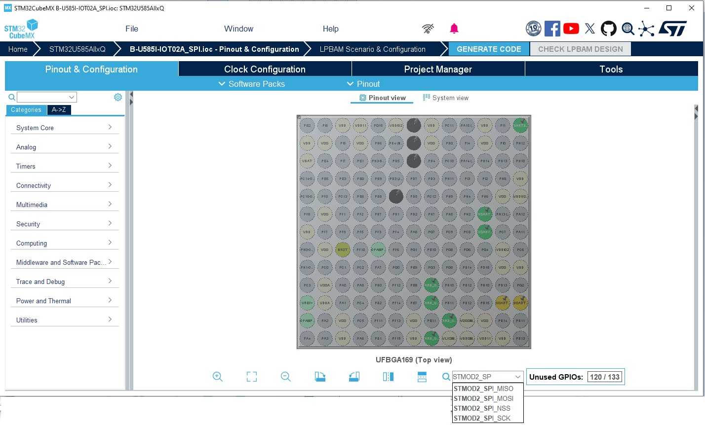

# B-U585I-IOT02A_SPI
* This exampele shows how to configure and use the SPI interfaces connected to the Arduino and STMOD2 on the B-U585I-IOT02A board

* Two SPI interfaces configured. SPI1 and SPI3.
* SPI1 is connected to the ARDUINO connector
* SPI3 is connected to the STMOD+ 2 connector.

## ARDUINO Pins connections
* ARD_D13: SPI1_SCK  (ARD_SPI_SCK)
* ARD_D12: SPI1_MISO (ARD_SPI_MISO)
* ARD_D11: SPI1_MOSI (ARD_SPI_MOSI)
* ARD_D10: SPI1_NSS  (ARD_SPI_NSS)







## STMOD+2 Pins connections

* STMOD2_1: SPI3_NSS  (STMOD2_SPI_NSS)
* STMOD2_2: SPI3_MOSI (STMOD2_SPI_MMOSI)
* STMOD2_3: SPI3_MISO (STMOD2_SPI_MISO)
* STMOD2_4: SPI3_SCK  (STMOD2_SPI_SCK)








## Code examples

### USE SPI1 connected to ARDUINO

  ```
  HAL_GPIO_WritePin      ( ARD_SPI_NSS_GPIO_Port, ARD_SPI_NSS_Pin, GPIO_PIN_RESET);
  HAL_SPI_TransmitReceive(&ARD_SPI, tx_data_2, rx_data_2,DATA_SIZE_2, 0xFFFFFFFF);
  HAL_GPIO_WritePin      ( ARD_SPI_NSS_GPIO_Port, ARD_SPI_NSS_Pin, GPIO_PIN_SET);
  ```

### USE SPI3 connected to STMOD2

  ```
  HAL_GPIO_WritePin      ( STMOD2_SPI_NSS_GPIO_Port, STMOD2_SPI_NSS_Pin, GPIO_PIN_RESET);
  HAL_SPI_TransmitReceive(&STMOD2_SPI, tx_data_1, rx_data_1,DATA_SIZE_1, 0xFFFFFFFF);
  HAL_GPIO_WritePin      ( STMOD2_SPI_NSS_GPIO_Port, STMOD2_SPI_NSS_Pin, GPIO_PIN_SET);
  ```

  ## Boards Needed

  * [B-U585I-IOT02A](https://www.st.com/en/evaluation-tools/b-u585i-iot02a.html)

## Software tools
* [STM32CubeIDE](https://www.st.com/stm32cubeide)
* [STM32CUbeMX](https://www.st.com/stm32cubemx)


## How to use
* Clone the repo
* Open B-U585I-IOT02A_SPI.ioc file with [STM32CUbeMX](https://www.st.com/stm32cubemx) and generate the project 
* Open the generated project with [STM32CubeIDE](https://www.st.com/stm32cubeide)
* Build and run the example

## Troubleshooting

**Caution** : Issues and the pull-requests are **not supported** to submit problems or suggestions related to the software delivered in this repository. The example is being delivered as-is, and not necessarily supported by ST.

**For any other question** related to the product, the hardware performance or characteristics, the tools, the environment, you can submit it to the **ST Community** on the STM32 MCUs related [page](https://community.st.com/s/topic/0TO0X000000BSqSWAW/stm32-mcus).
